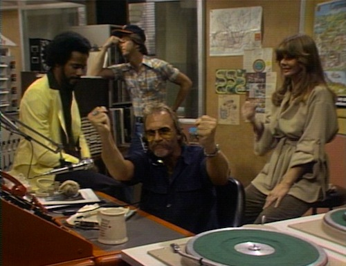
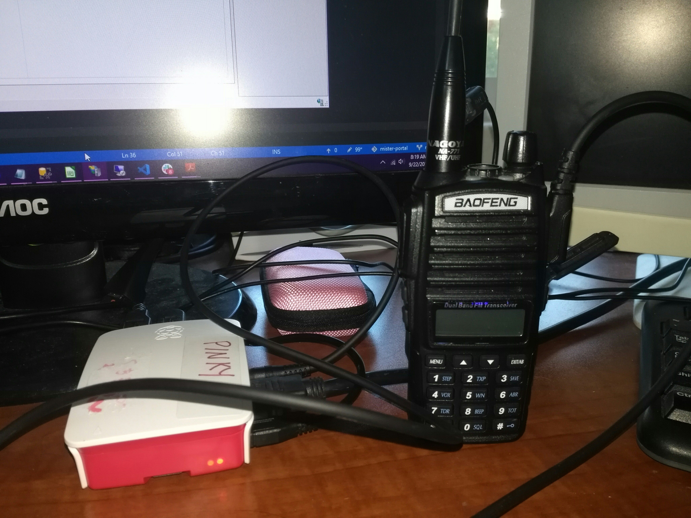
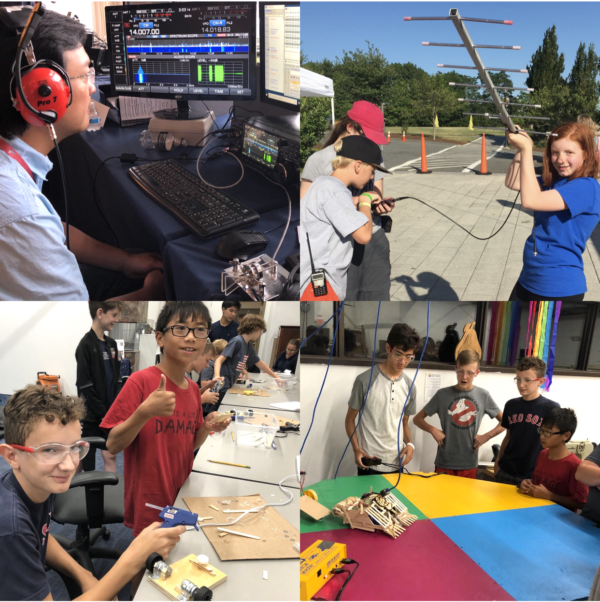
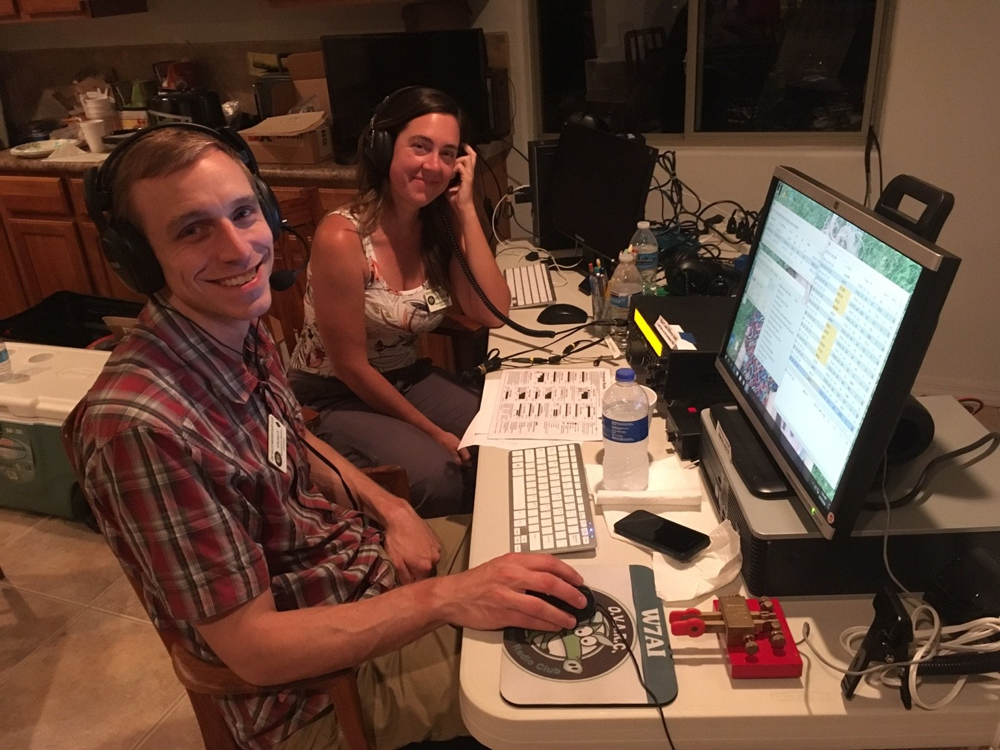
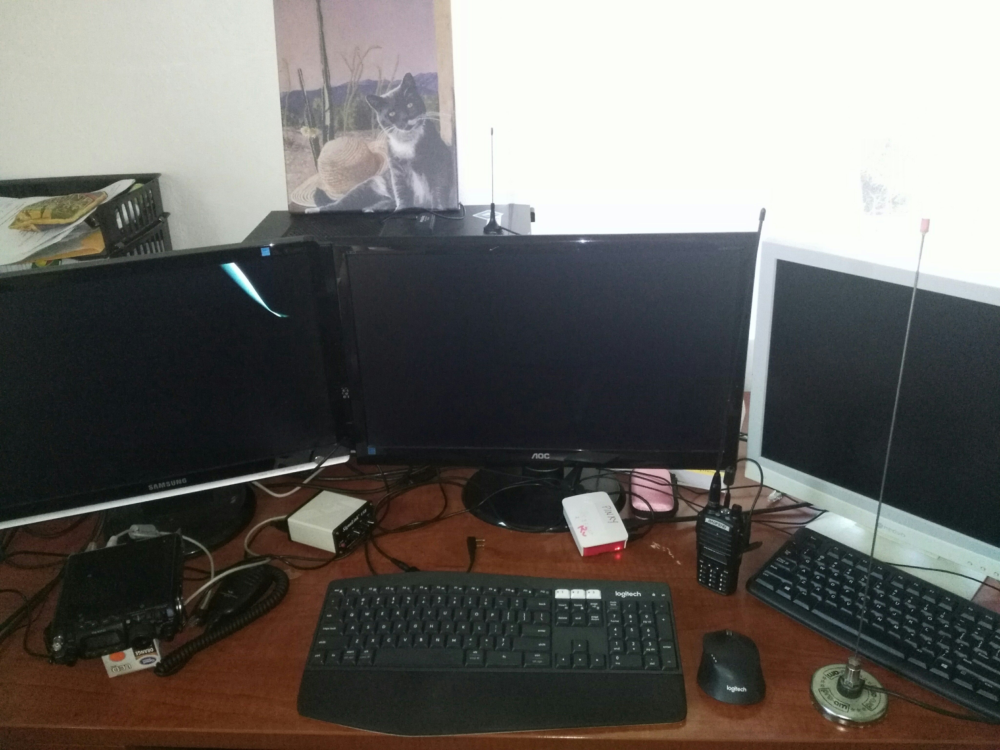
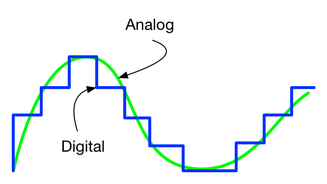
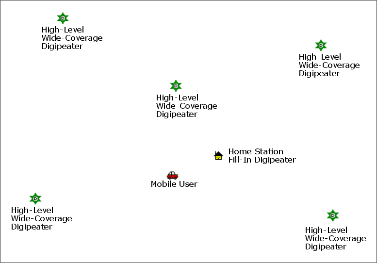
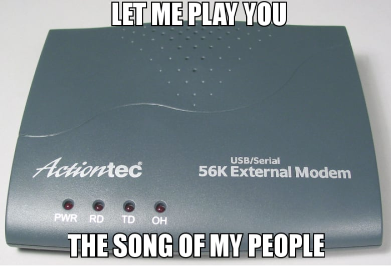
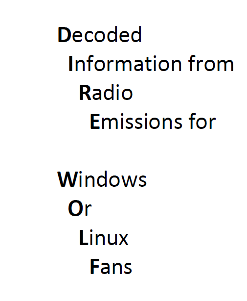

# F# and Ham Radio
Marnee Dearman 

`KG7SIO`

Functional domain modeling for APRS (digital packet radio) using F#.

This is a markdown version of my original 15-minute lightning talk at `OpenFSharp 2019`.

## What comes to mind when I say Ham Radio or Amateur Radio?

Did you think of some `groovy` DJ spinning records at a radio station?

Ya know, like WKRP in Cincinnati ... ?



Or maybe you though about Wolfman Jack and a pirate radio station?

Sorry to disappoint, but that is not Ham Radio.

Ham Radio is about using the radio waves for `global communications`, like

* Talking to people really far away without using the internet
* Sharing information
* Emergency communications


It's also about

Radio technology (software and hardware)



Having fun applying science and engineering principles



But most importantly it's about ... `Making friends!` (and Field Day)



## How do I do ham radio?

This is my radio station



From left to right we have:

* Yaesu tri-band mobile tranceiver
* Signalink USB sound card
* Pinky Pi, the Raspberry Pi 3
* Baofeng dual-band handheld tranceiver
* Mobile antenna

If you look in the back next to the cat you will see my SDR-RTL antenna. It works great for development and testing purposes.

On the roof I have a Ubiquity Bullet M2 Titanium outdoor radio and flat panel antenna where the TV antenna used to be. This radio is joined to the Souther Arizona mesh network with the AREDN software. 

TODO put image here

## Amateur radio paradigms

In Amateur Radio we have to paradigms: digital and analog. Since this is a talk about APRS, we will be talking about the `digital paradigm`.



## APRS and Packet Radio

APRS stands for `Automatic Packet Reporting System`. 

### APRS defines two things

* How to propagate messages through an ad-hoc network of radio stations
* Data formats

#### Message propagation

This is a simulation of how an APRS message would propagate through an APRS network.



#### Data formats

APRS defines lots of data formats in a variety of categories such as:

* Position Reports
* Weather Reports
* Telemetry
* Messages (announcements, bulletins)

The most interesting one is `user-defined` data formats. APRS provides a way to identify and define your own data formats.

## Cool. How do I get started with APRS?

There are many APRS clients and applications out there. Some of them are very feature rich, and work well.

But I am a software engineer so I want to be able to extend the client and possibly add support for my own User-Defined data formats. The existing software fall into the categories of a few problems:

* Not extensible
* Not written in a language I know
* Not well maintained or not quite working

So what is an engineer to do?

Do it yourself, of course! So that is what I did.


## Ok, but what am I up against here?


After spending a lot of time reading and trying to decipher the APRS specification, I figured out that it is all about the `AX.25 data link layer protocol`.


As it turns out, Linux ships with support for AX.25. 

[AX.25 is an old-timey data link layer protocol](https://en.wikipedia.org/wiki/AX.25) that works kinda like dial-up modems. Basically it turns your data into screeching modem noises.



Soooo ... does this mean I am going to have to write an interface to a data link layer? I dunno if I am up for that.


## DireWolf

Naw man! I can just use [DireWolf](https://github.com/wb2osz/direwolf).



DireWolf is something called a [`software terminal node controller` or `TNC`](https://en.wikipedia.org/wiki/Terminal_node_controller) for short. TNCs are the interface between the user and AX.25.

> Thanks to WB2OSZ for creating DireWolf -- it just works!

A basic flow would look like this:

```text
DireWolf converts data into an AX.25 Formatted Frame
    -> AX.25 sends that out over the sound card/audio port
        -> The sound card is attached to the sound card and when triggered will transmit that sound

The radio receives a transmission
    -> The AX.25 data link layer picks up that transmission on the sound car
        -> DireWolf decodes the AX.25 frame

```

## How does it work?

*DireWolf makes this easy.*

DireWolf can read from a file and transmit what is in the file, and it can write to a file a received transmission. So, if I want to integrate with DireWolf I can write to a file for DireWolf to read, and read the file that DireWolf creates.

I can do that!

The process then looks like this


*The yellow arrows are where I can plug in my own software.*

### Transmitting 

1. DireWolf reads from a file. 
2. DireWolf converts the contents to AX.25
3. AX.25 sends that out over the sound card/audio port to be transmitted by the radio

### Receiving

1. The radio received a radio signal
2. AX.25, listening on the sound card interface, decodes the signal into an AX.25 frame
3. DireWolf parses the AX.25 frame and writes the data to a file.

### What does my physical setup look like?


This is all I need to make it work.

This is my Baofeng radio connected to my Raspberry Pi through an audio cable connected to a USB sound card.

> It just works.

